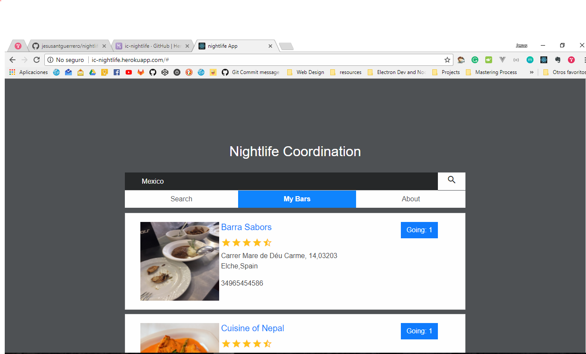

# Nightlife coordinator App

It is a web application built with nodejs, mongodb, express and react fusion that allow users to see the bars in their area and see how many people are going and add theirselves to the list.

The results are powered by yelp.

[freeCodeCamp nightlife coordinator requirements](https://www.freecodecamp.org/challenges/build-a-nightlife-coordination-app)

It is part of freeCodeCamp backend certification and it meets the fallowing user stories:

- User Story: As an unauthenticated user, I can view all bars in my area.

- User Story: As an authenticated user, I can add myself to a bar to indicate I am going there tonight.

- User Story: As an authenticated user, I can remove myself from a bar if I no longer want to go there.

- User Story: As an unauthenticated user, when I login I should not have to search again.